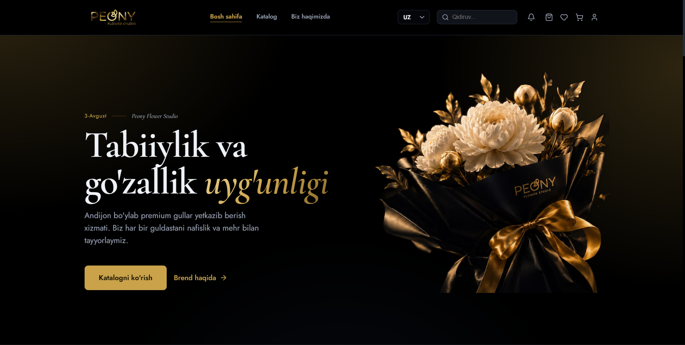
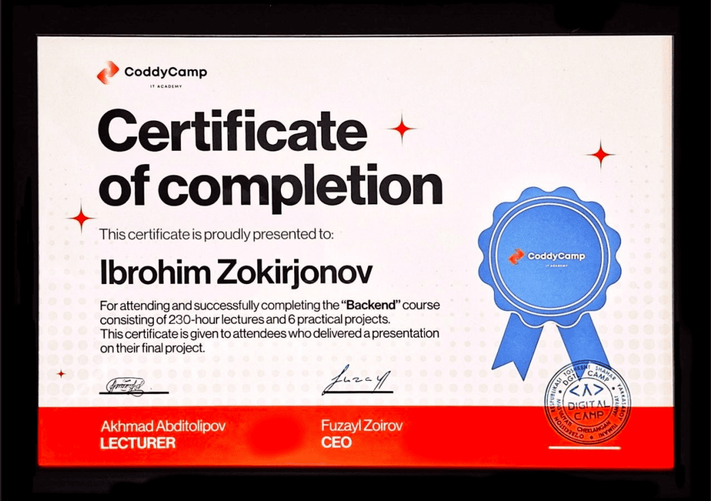
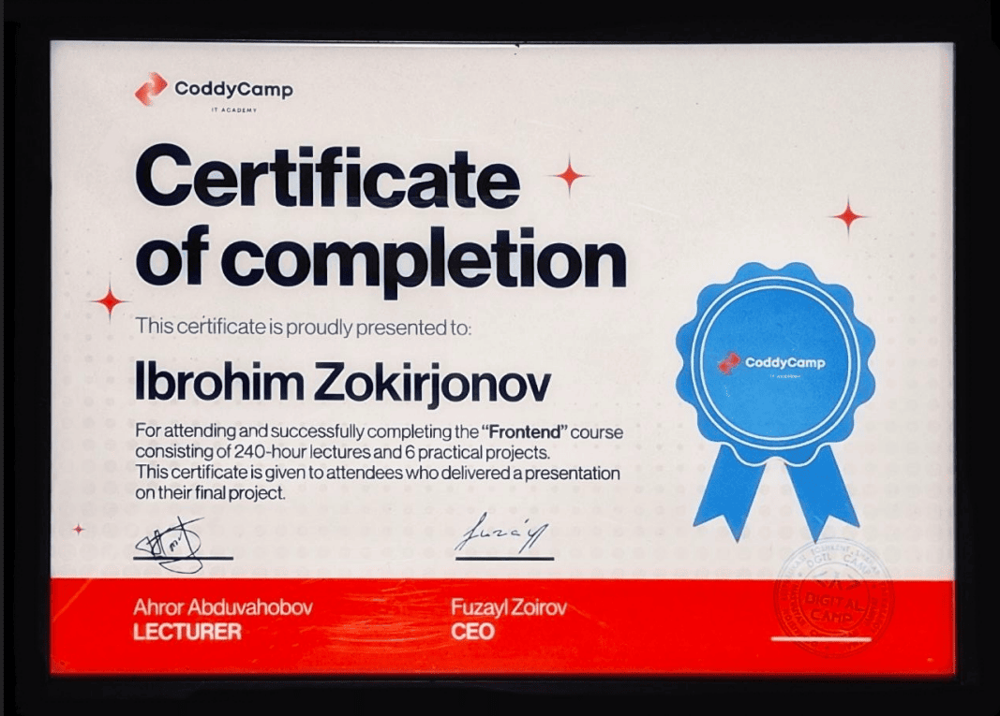

<table width="100%">
<tr>
<td width="160" valign="middle" align="left">

</td>
<td valign="middle">

# Ibrohim Zokirjonov
### Full-Stack Developer · Frontend

</td>
</tr>
</table>

<h3 >About </h3>

Full-stack developer and PDP University student, able to build web applications independently from end to end — from the user-facing interface to the server and database.

As a personal project, I built a complete platform intended for real users, staying with it through development and completion to prove I follow through to results.

I completed the full Frontend and Backend tracks at CoddyCamp IT Academy, defending 4 hands-on projects, and I also mentor fellow students at university.

I'm a fast learner, responsible, enjoy working in a team, and ready to grow in a hands-on environment.

 

<h3 >Work Experience </h3>

**QA Tester — Faktura.uz**
Full-time &nbsp;·&nbsp; Jun 2026 — Present

- Studying task descriptions in depth or clarifying requirements with developers to confirm the intended logic and updated system behavior before starting work
- Designing test cases ahead of or early in development
- Executing test cases to verify functionality and localize bugs
- Coordinating findings with a senior specialist before filing a detailed bug report or task comment, including reproduction steps, test cases used, and screenshots
- Consistently delivering assigned tasks on schedule

**Full-Stack Developer — Freelance**
Tashkent, Uzbekistan &nbsp;·&nbsp; May 2026 — Present

- Building complete web platforms end to end — from architecture to final interface — covering the client side, server side, and database
- Creating role-based admin systems for managing orders, users, and content
- Implementing multilingual (Uzbek/Russian/English) interface support for the local market
- Independently owning the whole process, from design and development through testing and delivery

 

<h3 >Current Project </h3>

  

<b>Peony Flowers Studio</b> — Premium flower delivery platform (Personal project) 
Full-Stack Developer &nbsp;·&nbsp; 2026 — Present

**What the company does:**
[Peony Flower Studio](https://peonyflowerstudio.uz/uz) is a real business providing premium flower and bouquet delivery across Andijan, Uzbekistan, for weddings, birthdays, and holidays, with each bouquet prepared with care and craftsmanship. I'm building the company's full online ordering platform as a full-stack developer.

**What the platform does:**

- Customers browse the catalog, choose flowers and bouquets, select delivery or pickup, and place cash-on-delivery orders online
- Each staff role has its own dedicated workspace: the **florist** prepares the order, the **courier** handles delivery, and the **admin** oversees the entire process
- Returning customers get automatic discounts based on order count, plus a one-time bonus for leaving a product review
- Checkout is broken into clear, simple steps — address selection, delivery time scheduling, and payment confirmation

  

 

<h3 >Licenses & Certifications </h3>

<table width="100%">
<tr>
<td width="50%" valign="top" align="left">

**CoddyCamp IT Academy — Backend**
230-hour course · 6 hands-on projects · final project defense

</td>
<td width="50%" valign="top" align="left">

**CoddyCamp IT Academy — Frontend**
240-hour course · 6 hands-on projects · final project defense

</td>
</tr>
</table>

 

<h3 >Leadership Experience </h3>

**PDP University — "Tengdosh Ustoz" (Peer Mentor) Program**
Peer Mentor &nbsp;·&nbsp; 2025 — Present

- Mentored students in full-stack development as part of the program, helping improve their code quality and technical confidence
- Reviewed group members' frontend and backend assignments, explaining concepts in Vue.js, Node.js, Express, and MongoDB

 

<h3 >Education </h3>

<table width="100%">
<tr>
<td width="50%" valign="top" >

 
 

**PDP University — Tashkent**
BTEC Higher National Diploma / Software Development
Oct 2025 — Oct 2030

Official Pearson BTEC international education center in partnership with the UK, focused on hands-on projects in software development, networking, and data science.

</td>
<td width="50%" valign="top" >

 
 

**School No. 104 — Tashkent**
General Secondary Education
Sep 2014 — May 2025

Completed 11 years of general education with an emphasis on mathematics, physics, and computer science.

</td>
</tr>
</table>

 

<h3 >Skills </h3>

Full-Stack Development • Software Architecture • UI Design • Problem Solving • Time Management • Teamwork • Mentorship

 

<h3 >Technical Skills </h3>

**Frontend**

**Backend**

**Database**

**Tools**

**Currently Learning**

 

<h3 >Languages </h3>

 

<h3 >Interests </h3>

Gym · Football · Chess · Reading anything book

 

<i>Always learning, always building.</i>

