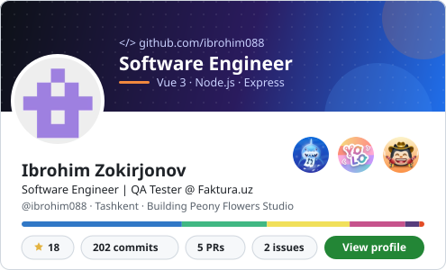
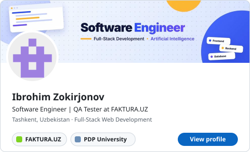
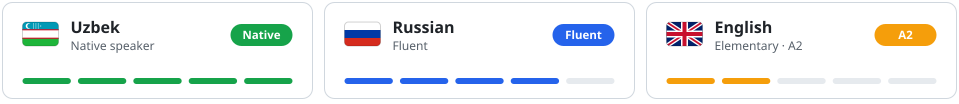

---

## About

Software engineer from Tashkent. I build web applications end to end — interface, server, database — and test them like a QA engineer. I enjoy taking real projects from planning and structure to final delivery, with attention to detail and products that are easy to use.

Working on both sides of software gives me a practical advantage: as a developer I know where bugs usually hide, and as a QA tester I know how a real user breaks things. I care about clean structure, clear error handling, readable code, and interfaces that work in more than one language.

**What I do**
- Build full-stack web platforms: customer storefront, admin panel, REST API, database
- Design role-based systems (admin, florist, courier) with separate workspaces
- Create bilingual (Uzbek/Russian) interfaces and content management
- Test products manually: requirements review, test cases, bug reports

**Currently:** QA Tester at **Faktura.uz**, freelance full-stack developer, student at **PDP University**.

## Contacts

## Experience

**QA Tester** · Faktura.uz · *Jun 2026 — Present*
Quality assurance for a product team working with developers on a daily basis.

- Clarify requirements with developers before testing starts
- Design test cases early, so problems are found before release
- Execute manual tests and verify fixes
- File bug reports with clear steps, test cases, and screenshots

**Full-Stack Developer** · Freelance · *May 2026 — Present*
Complete web platforms for clients, from architecture to the final interface.

- Role-based admin systems with separate workspaces for each role
- Multilingual (Uzbek/Russian) user interfaces
- REST API with authentication, file uploads, and database design
- Full cycle: design → development → testing → deployment → handover

## Featured Project

**[Peony Flowers Studio](https://peonyflowerstudio.uz/uz)** · client project · Jul — Aug 2026

Online store, admin panel, and Telegram bot for a flower business in Andijan. Built from scratch, deployed, and handed over.

**Customer side**
- Catalog with categories and product pages, cart, and checkout
- Delivery or pickup, map-based address selection, cash-on-delivery payment
- Automatic delivery pricing: free delivery inside the city zone, fixed fee outside it
- Personal account with order history and order details
- Automatic loyalty discounts and review bonus

**Business side**
- Separate workspaces for florist, courier, and admin
- Order flow with statuses: confirmed → preparing → ready → delivery
- Courier view with delivery location and route on the map
- Inventory management, Excel import/export
- Editable site content (About page) from the admin panel, in both languages

**Technical**
- Vue 3 + Pinia + Vite (storefront and admin panel as separate apps)
- Node.js, Express, TypeScript, Prisma, MySQL, Redis caching
- JWT authentication, role-based access, Yandex Maps integration
- Bilingual interface (Uzbek/Russian)

## GitHub & LinkedIn

<picture>
<source media="(prefers-color-scheme: dark)" srcset="https://github-readme-stats.vercel.app/api?username=ibrohim088&show_icons=true&hide_border=true&hide_rank=true&bg_color=00000000&title_color=58a6ff&text_color=c9d1d9&icon_color=58a6ff">

</picture>
<picture>
<source media="(prefers-color-scheme: dark)" srcset="https://github-readme-stats.vercel.app/api/top-langs/?username=ibrohim088&layout=compact&hide_border=true&bg_color=00000000&title_color=58a6ff&text_color=c9d1d9">

</picture>

## Skills

| Area | Technologies |
|---|---|
| **Frontend** | Vue 3, Pinia, Vite, JavaScript, TypeScript, HTML/CSS, Sass, Leaflet, Yandex Maps |
| **Backend** | Node.js, Express, REST API's, JWT Authentication, Multer (file uploads)|
| **Database** | NoSQL, MySQL, MongoDB (Mongoose)|
| **Tools** | Git, GitHub, Postman, Swagger, Axios, AWS S3 |
| **QA** | Manual testing, Test Case Design, Bug Reports, Requirements Analysis |

## Education

**PDP University** — Tashkent · *Oct 2025 — Oct 2029*
BTEC Higher National Diploma, Software Development (Pearson BTEC, in partnership with the UK)

**CoddyCamp IT Academy** — *Jan 2023 — Jun 2025*
Backend (230 h, 6 projects) and Frontend (240 h, 6 projects), both with final project defense.

## Leadership

**Peer Mentor** — PDP University, "Tengdosh Ustoz" program · *2025 — Present*
Mentor students in full-stack development, review frontend and backend assignments, explain Vue.js, Node.js, Express, and MongoDB.

- Review students' frontend and backend assignments and give written feedback
- Explain core concepts: components and state in Vue, routing and middleware in Express, schemas in MongoDB
- Help students debug their code and build projects step by step

## Languages

